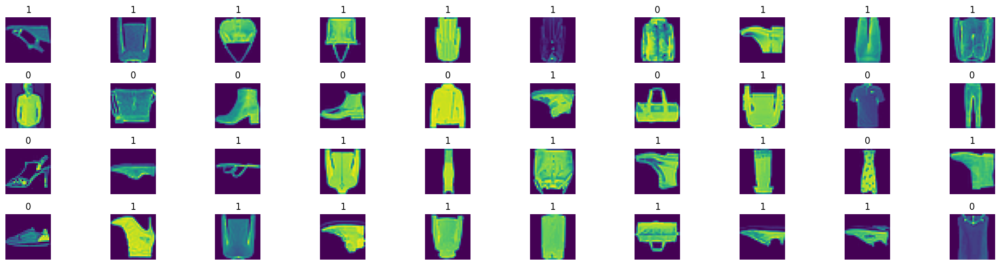
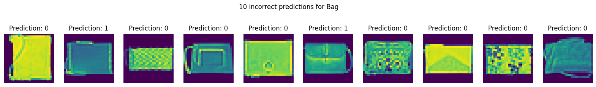
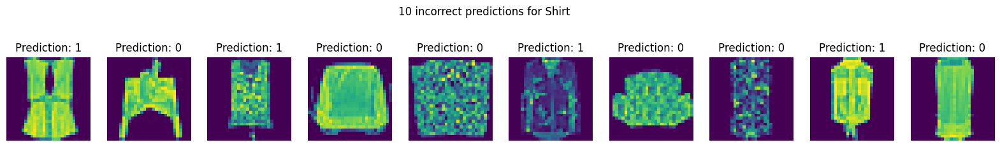
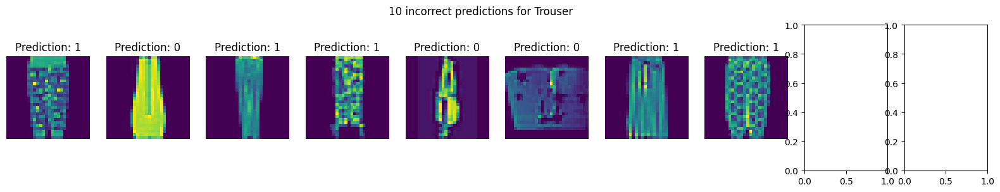

# Vertical Image Flip Detection using CNN and MobileNet

## Project Overview

This project aims to build a machine learning model to detect if an image has been vertically flipped. The project uses the MNIST dataset, implements two models (a CNN classifier and MobileNet), and evaluates their performance.

## Project Structure

- **Dataset**: MNIST
- **Models**: CNN Classifier and MobileNet
- **Frameworks**: TensorFlow, Keras

## Steps to Run the Project

1. **Clone the Repository**

   ```bash
   git clone https://github.com/Thinhrichkidz/vertical-image-flip-detection.git
   cd vertical-image-flip-detection
   ```

2. **Install Dependencies**
   Ensure you have Python installed. Then, install the required libraries.

   ```bash
   pip install -r requirements.txt
   ```

3. **Run the Jupyter Notebook**
   Open the `AI.ipynb` file in Jupyter Notebook or Jupyter Lab and run the cells sequentially.
   ```bash
   jupyter notebook AI.ipynb
   ```

## Code Explanation

### Data Preparation

- **Dataset Loading**
  The MNIST dataset is loaded using the `datasets` library.

  ```python
  from datasets import load_dataset
  mnist = load_dataset('mnist')
  ```

- **Data Labeling**
  Images are labeled as 1 if flipped and 0 if not flipped. The flipping is done programmatically.
  ```python
  def flip_vertical(image):
      return np.flipud(image)
  ```



- **Data Splitting**
  The dataset is split into training (80%) and testing (20%) sets.
  ```python
  X_train, X_test, y_train, y_test = train_test_split(images, labels, test_size=0.2)
  ```

### Model Building

- **CNN Classifier**
  A Convolutional Neural Network (CNN) is defined using TensorFlow and Keras.

  ```python
  from tensorflow.keras.models import Sequential
  from tensorflow.keras.layers import Conv2D, MaxPooling2D, Flatten, Dense

  cnn_model = Sequential([
      Conv2D(32, (3, 3), activation='relu', input_shape=(28, 28, 1)),
      MaxPooling2D((2, 2)),
      Flatten(),
      Dense(128, activation='relu'),
      Dense(1, activation='sigmoid')
  ])
  ```

- **MobileNet Classifier**
  MobileNet is used as a transfer learning model.
  ```python
  from tensorflow.keras.applications import MobileNet
  base_model = MobileNet(input_shape=(224, 224, 3), include_top=False, weights='imagenet')
  ```

### Model Training

- **Training Process**
  The models are trained on the training set with hyperparameter tuning to achieve the best accuracy.
  ```python
  cnn_model.compile(optimizer='adam', loss='binary_crossentropy', metrics=['accuracy'])
  cnn_model.fit(X_train, y_train, epochs=10, validation_data=(X_test, y_test))
  ```

### Model Evaluation

- **Evaluation Metrics**
  The models are evaluated using the test set, and metrics such as accuracy, confusion matrix, and classification report are generated.
  ```python
  from sklearn.metrics import classification_report
  y_pred = cnn_model.predict(X_test)
  print(classification_report(y_test, y_pred))
  ```

### Misclassified Images

- **Visualization**
  The project includes visualization of 10 misclassified images from the three most error-prone classes.
  ```python
  plt.imshow(misclassified_image)
  plt.show()
  ```

## Results

- **Accuracy**
  At least one model achieves over 98% accuracy.
- **Misclassification Analysis**
Analysis of top 3 misclassified classes is provided to understand the factor of misclassification.
<div>
  
  
  
</div>

## References

- [MNIST Dataset](https://www.tensorflow.org/datasets/catalog/mnist)
- [TensorFlow Documentation](https://www.tensorflow.org/overview)
- [Keras Documentation](https://keras.io/docs/)
